# Fundamentos de Redes de Computadores

## Trabalho 1

## Professor Tiago Alves

## Aluno Rafael Makaha Gomes Ferreira - 160142369

## Camada de Aplicação: Cliente DNS

### Observações

Gostaria de dizer que este trabalho me ajudou bastante a entender o funcionamento do protocolo UDP. E, também, me ajudou bastante a relembrar o quão trabalhoso é escovar bits em aplicações.
Posso, agora, apreciar bem mais o nível de evolução das tecnologias em que chegamos nos dias atuais.

Estou bem orgulhoso com o resultado deste projeto. Houve grande empenho e esforço. Gostaria de agradecer a dois amigos, mas os mesmo pediram para não serem referenciados. Talvez em um outro momento...

### 1. Introdução

A disciplina de Fundamentos de Redes de Computadores trata de diversos tópicos relativos a
Sistemas Operacionais, sistemas que provêem uma forma intuitiva de se utilizar as funcionalidades
de computadores digitais sem que seja necessário ao usuário ou programador ter profundo
conhecimento das interações entre os diferentes hardwares que compõem um computador.
Para construir ou adicionar funcionalidades a esses sistemas computacionais, é necessário
conhecimento de linguagens de programação e ferramentas de desenvolvimento.

### 2. Objetivos

 - [X] Exercitar conceitos de programação de sistemas operacionais.
 - [X] Estudar a implementação de esquemas de comunicações entre processos (IPC), especificamente a utilização da interface socket.

### 3. Referencial Teórico e Sites

- Mitchell, Mark, Jeffrey Oldham, and Alex Samuel. Advanced linux programming. New Riders, 2001.
- https://gist.github.com/fffaraz/9d9170b57791c28ccda9255b48315168
- https://linux.die.net/man/
- http://www.cis.syr.edu/~wedu/seed/Labs_16.04/Networking/DNS_Remote/udp.c

### 4. Material Utilizado

- Computador com sistema operacional programável
-  Ferramentas de desenvolvimento GNU/Linux ou similares: compilador GCC, depurador, editor de texto.

### 5. Roteiro

1) Revisão de técnicas e ferramentas de desenvolvimento de aplicações para o sistema operacional Linux. Colete o material acompanhante do roteiro do trabalho a partir do Moodle da disciplina e estude os
princípios e técnicas de desenvolvimento de aplicações para o sistema operacional Linux.
2) Realizar as implementações solicitadas no questionário do trabalho

### 6. Implementações e Questões para Estudo

1. Escreva um cliente para o protocolo DNS.
- O cliente receberá entradas do teclado e tentará realizar o envio de uma requisição DNS
(RFC1034 e RFC1035).
    - O primeiro argumento da linha de comando deverá informar o endereço o nome cuja
resolução se procura. O segundo argumento informará o IP do servidor DNS que será consultado.
• O servidor funcionará na porta padrão para o serviço DNS: UDP 53
• Firewalls podem impedir com que pacotes com as consultas alcancem servidores localizados fora da rede de acesso.
- Em relação ao formato do payload UDP da consulta, seguem orientações:
    - O cliente deverá realizar apenas consultas do tipo A (host address)
    - Transaction ID (16 bits): o cliente deverá gerar um número aleatório de 16 bits para identificar a transação/consulta.
    - Flags (16 bits): as flags de consulta deverão indicar uma consulta recursiva. Dessa forma, os 16 bits de deverão estar codificados em 0x0100.
    - Question (16 bits): deverá indicar apenas 1 consulta e, desta forma, deverá estar codificado em 0x0001.
    - Answer RRs, Authority RRs, Additional RRs (todos os três são campos de 16 bits): deverão estar codificados em 0x0000.
    - Query: a query deverá informar uma consulta Type A, Class IN para o Name informado como primeiro parâmetro da linha de comando.
- A implementação do cliente deverá utilizar o protocolo UDP como protocolo de
transporte.
    - Como o protocolo UDP é orientado a mensagem, o cliente deverá aguardar 2 segundos pela chegada da resposta. Caso a resposta não tenha chegado, uma nova tentativa deverá ser realizada.
    - O cliente tentará resolver o nome por até 3 vezes. Depois da terceira vez, uma mensagem de erro deverá ser informada ao usuário.
    - Caso o nome apresentado pelo usuário não exista, 
- O resultado da consulta DNS deverá ser informado na saída padrão (stdout do console) e deverá ter o seguinte formato:
    - nome <> IP.
- Para informar o resultado da consulta, será necessário interpretar a mensagem retornada pelo servidor e extrair a informação do IP de seu payload.
  
- Exemplos de interação:

    Resolução bem sucedida

        $ ./meu_cliente fga.unb.br 8.8.8.8
        fga.unb.br <> 164.41.98.10

    Resolução com falha: nome não existe

        $ ./meu_cliente azertyoiuoiu.unb.br 1.1.1.1
        Host azertyoiuoiu.unb.br não encontrado

    Resolução com falha: servidor não existe/não atendeu

        $ ./meu_cliente fga.unb.br 1.2.3.4
        Nao foi possível resolver fga.unb.br

- Restrições:
    - Para este trabalho, será admitida a utilização de bibliotecas auxiliares para para suporte à implementação. Quando se tratar de serviços de comunicação, apenas bibliotecas de socket UDP da sua linguagem preferida de programação poderão ser utilizadas.
    - Bibliotecas auxiliares serão permitidas

### 7. Desenvolvimento e Comentários

O código está devidamente comentado para fins didáticos e para revisões futuras a respeito do assunto abordado neste projeto.

Iniciaremos um tour pelos passos que o projeto oferece:

1. Includes e Defines:

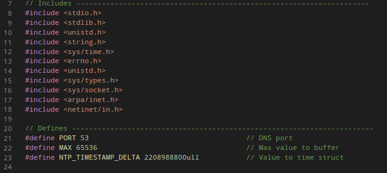

Foram utilizadas diversas bibliotecas para auxiliar na manipulação dos dados e, principalmente, na utilização de sockets.

2. Structs:

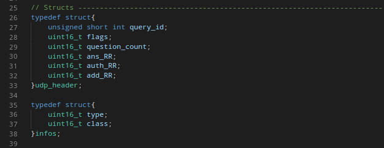

Foram utilizadas apenas duas structs, onde as duas são referentes ao armazenamento e estruturação do pacote UDP.

A primeira Struct é responsável por armazenar o cabeçalho do pacote e, a segunda, as informações a respeito da query. A PERGUNTA não foi adicionada ao struct por parecer mais fácil a manipulação da mesma.

3. Iniciando variáveis:

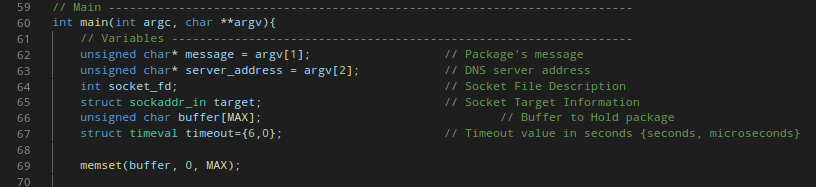

- message : PERGUNTA a ser feita ao servidor DNS
- server_address : armazena o enderço DNS de destino para nossa PERGUNTA
- socket_fd : responsável por referenciar as informações do nosso socket
- target : struct padrão da biblioteca que armazenará as informações a respeito do host de destino, no envio, e de recebimento, no retorno.
- buffer : responsável por armazenar todas as informações do nosso pacote de maneira sequencial
- timeout : armazena o tempo limite de espera da requisição

4. Inserindo informações do cabeçalho

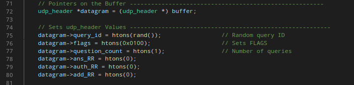

Cria-se o datagrama como um ponteiro de sua struct apontando para o inicio do buffer e insere-se todos os valores apresentados no roteiro de estudos.

5. Manipulação da mensagem

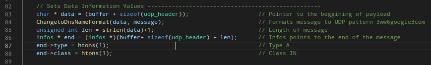

Aqui houve um grande investimento de tempo e raciocínio para se ter sucesso na conversão da mensagem para o formato padrão do protocolo UDP, onde, por exemplo, a mensagem "www.google.com" deve ser enviada como "3www6google3com". (desfaio 1)

Em seguida, é feito o acoplamento de mais valores do enunciado da questão à mensagem e, ambos são acoplados ao buffer.

A seguite função dá conta do recado para fazer a transformação necessária da mensagem.

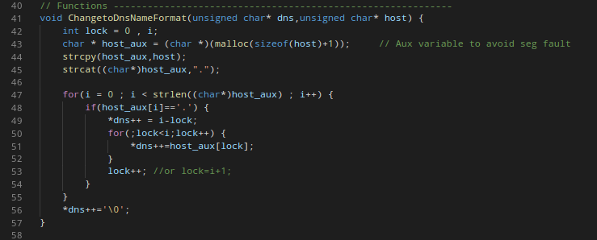

6. Criação do Socket

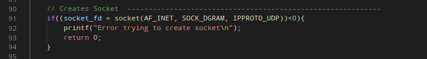

Implementação padrão de criação de socket com os parâmetros indicando:

- AF_INET : indica que envolverá rede de internet e uma local;
- SOCK_DGRAM : indica que o pacote será um datagrama, ou seja, UDP
- IPPROTO_UDP : indica que irá utilizar protocolo UDP, mas creio que seja equivalente ao valor 0, pois já foi indicado que será protocolo UDP pelo parâmetro SOCK_DGRAM.

7. Configurando Socket

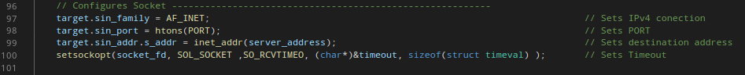

São adicionadas porta e destino a struct que armazena as informações do hospedeiro de destino.

É, também, alterado o comportamento padrão do nosso socket (socket_fd) para se utilizar da funcionalidade de TIMEOUT.

8. Revisando o tamanho do pacote

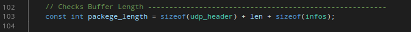

Indica-se o tamanho total do nosso pacote de envio para que não haja envio de nenhuma informação a mais ou a menos no nosso pacote.

9. Enviando e recebendo pacotes

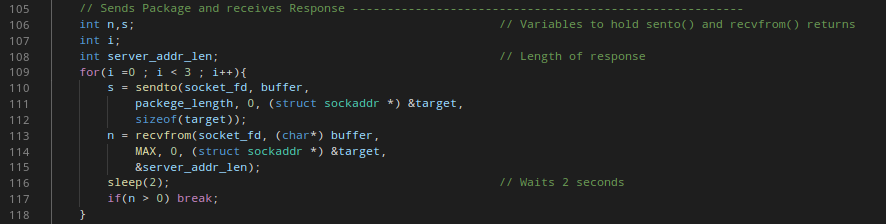

Aqui hove grande dificuldade para o entendimento do funcionamento das funções sendto() e recvfrom(). (desafio 2)

Aqui fazemos o envio do pacote. A variável s aramzena a quantidade de bytes que foram enviados no pacote pela função sendto(). Essa, utiliza em seus parâmetros:

- socket utilizado para realizar envios
- buffer contendo o pacote completo
- tamanho do pacote
- informações do hospedeiro de destino

Em seguida, a função recvfrom() se encarrega de receber o pacote de retorno da requisição realizada. A variável n armazena a quantidade de bytes recebidos no pacote de resposta e, os parâmetros se referem a:

- socket utilizado para realizar recebimentos
- buffer para armazenar o pacote da resposta
- tamanho do pacote
- informações do hospedeiro de recebimento 

10. Apresentando os dados

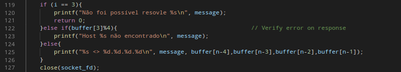

Este foi um dos momentos que houve maior lentidão. (desafio 3)

É feita a verificação de TIMEOUT da requisição, de erros no pacote ou apresentação da resposta com o endereço IP da requisição realizada

### 8. Desafios

Estre projeto foi, em si, muito trabalho. Diversos desafios foram encontrados ao longo do desenvolvimento. A seguir, são apresentados alguns deles.

#### Desafio 1

Foi bem difícil pensar em alguma maneira de transformar a mensagem para a formatação padrão do protocolo UDP. Tentei realizar esta transformação já pelo input dos parâmetros de chamada do terminal, mas percebi que não funcionava corretamente. 

A transformação a ser realizada era específica. Pesquisei bastante, mas não consegui pensar em uma maneira de realizar a operação. A função ChangetoDnsNameFormat() foi retirada de outro projeto que já está refernciado neste documento. Esta função deu conta do recado.

#### Desafio 2

Neste momento, houve problemas para o entendimento de como seria necessário enviar o pacote. Nas implementações iniciais, a mensagem estava agregada ao struct contendo as informações do HEADER. Com a evolução do projeto, a separação da mensagem do struct ajudou a realizar as operações mais facilmente.

Outro ponto importante foi entender o funcionamento da struct padrão que contém as informações do hospedeiro de destino. 

Consumi bastante tempo aqui.

#### Desafio 3

Último dia para o Dead Line. O cansaço bateu. Projetos não são 100 metros rasos, são maratonas que devem ser levados numa velocidade constante, mas no final devemos dar um gás.

A apresentação dos dados foi um problema bem grande, pois já sabia como havia enviado as informações do pacote como query. Entretanto, como response não tinha ideia de como as informações viriam. O applicativo WireShark ajudou bastante a visualizar que as informações retornavam quase que no mesmo formato do pacote de envio, mas com um acréscimo de informações ao final.

Entendida organização do pacote de resposta, a informação contendo o IP da PERGUNTA realizada estava sendo impresso na tela de maneira errônea. Alguns dos valores estavam aparecendo desconexos, com valores negativos  ou infieis ao valor real. O programa parecia totalmente correto, mas ainda assim, havia este erro de impressão.

O único momento em que tive ajuda foi este. Dois amigos, me ajudaram a encontrar a melhor maneira de acessar os valores procurados - por meio do acesso direto aos bytes do final do buffer - e o pulo do gato ao visualizar o motivo por trás dos valores erroneamente impressos na tela: 

    char buffer[MAX]

Como char, estava aceitando valores negativos e, ao corrigir para:

    unsigned char buffer[MAX]

O problema foi solucionado.

Fiquei muito feliz por realizar este trabalho e agradeço a ajuda dos dois, pois um detalhe tão pequeno passou despercebido por mim por diversas horas.